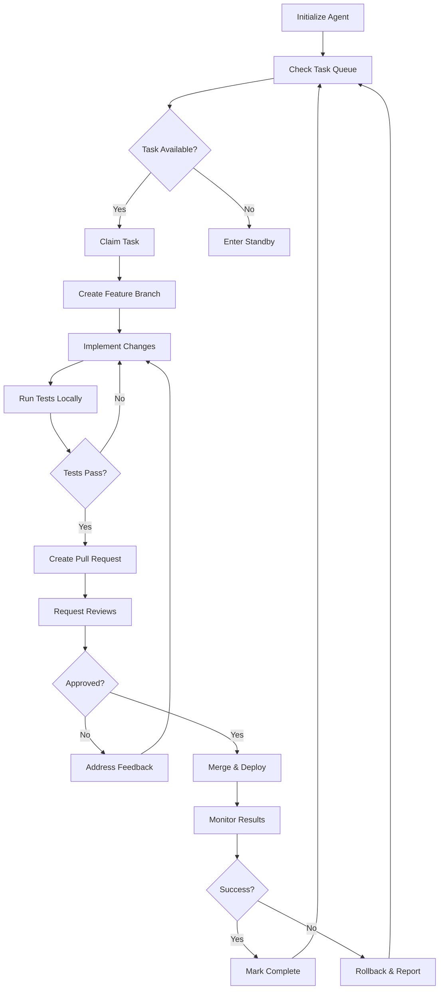
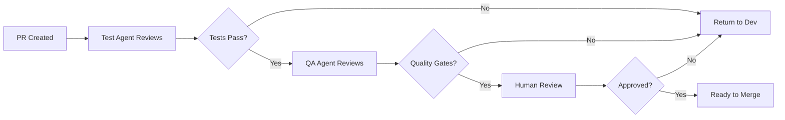

# Agent Workflow & Development Process

## Overview

This document defines the standard operating procedures for all agents in the multi-agent development system.

---

## Core Workflow Loop



---

## Phase 1: Task Acquisition

### 1.1 Check for Work
```bash
# Agents check GitHub Issues/Projects for tasks
# Priority order:
1. Critical bugs (production down)
2. High-priority features
3. Medium bugs
4. Low-priority enhancements
5. Tech debt
6. Documentation
```

### 1.2 Task Selection Criteria
- **Skill Match**: Agent capabilities align with task requirements
- **Dependencies**: No blockers on other tasks
- **Availability**: Agent is not already at capacity
- **Priority**: Higher priority tasks selected first

### 1.3 Claim Task
```markdown
**Action**: Comment on issue
**Format**: "🤖 Agent [NAME] claiming this task. ETA: [TIME]"
**Assignment**: Self-assign the issue
**Board**: Move to "In Progress"
```

---

## Phase 2: Development

### 2.1 Branch Strategy
```bash
# Branch naming convention
feat/<issue-number>-short-description     # New features
fix/<issue-number>-short-description      # Bug fixes
refactor/<issue-number>-short-description # Code improvements
docs/<issue-number>-short-description     # Documentation
test/<issue-number>-short-description     # Test additions

# Examples
feat/123-add-overtime-calculation
fix/456-timesheet-formula-error
```

### 2.2 Implementation Standards

#### Code Quality
- ✅ Follow existing code style
- ✅ Add comments for complex logic
- ✅ Keep functions small and focused
- ✅ Use meaningful variable names
- ✅ Handle errors gracefully

#### Testing Requirements
- ✅ Unit tests for new functions
- ✅ Integration tests for API changes
- ✅ E2E tests for UI changes
- ✅ All existing tests still pass
- ✅ Coverage does not decrease

#### Documentation
- ✅ Update README if behavior changes
- ✅ Add JSDoc comments to functions
- ✅ Update API documentation
- ✅ Create/update user guides
- ✅ Document breaking changes

### 2.3 Commit Standards
```bash
# Conventional Commits format
<type>(<scope>): <subject>

<body>

<footer>

# Types: feat, fix, docs, style, refactor, test, chore
# Examples:
feat(payroll): add overtime calculation for hourly employees
fix(export): correct formula offset in weekly timesheets
docs(api): update endpoint descriptions for v2
test(e2e): add regression test for #456
```

---

## Phase 3: Testing

### 3.1 Local Testing
```bash
# Before creating PR, run full test suite
cd labor-timekeeper
npm test

# Run E2E tests
npm run test:e2e

# Check code style
npm run lint

# Verify build
npm run build
```

### 3.2 Test Coverage Requirements
- **Minimum**: 80% line coverage
- **Target**: 90% line coverage
- **Critical paths**: 100% coverage

### 3.3 Manual Testing Checklist
- [ ] Feature works as expected
- [ ] No console errors
- [ ] Responsive on mobile
- [ ] Works in Chrome, Firefox, Safari
- [ ] Accessible (keyboard navigation, screen reader)
- [ ] No performance degradation

---

## Phase 4: Pull Request

### 4.1 PR Template
```markdown
## Description
Brief summary of changes and motivation.

## Related Issue
Closes #[issue-number]

## Changes Made
- Added X functionality
- Fixed Y bug
- Refactored Z component

## Testing
- [ ] Unit tests added/updated
- [ ] Integration tests pass
- [ ] E2E tests pass
- [ ] Manual testing completed

## Screenshots (if UI changes)
[Add screenshots here]

## Deployment Notes
Any special deployment considerations.

## Checklist
- [ ] Code follows style guidelines
- [ ] Self-reviewed code
- [ ] Commented complex code
- [ ] Updated documentation
- [ ] No breaking changes (or documented)
- [ ] Tests pass locally
```

### 4.2 Review Assignment
```markdown
**Automatic Reviewers**:
- Test Agent (for test validation)
- QA Agent (for quality gates)
- Code Owner (if applicable)

**Human Review Required For**:
- Production deployments
- Breaking changes
- Security-related changes
- Architectural decisions
```

### 4.3 Status Updates
```markdown
**Post PR creation**, update every 4 hours:
- Progress on addressing feedback
- Blockers encountered
- Estimated completion time

**Format**:
🤖 **Agent Status Update**
- ✅ Addressed feedback on lines 45-67
- 🔄 Running additional E2E tests
- ⏰ ETA for next update: 4 hours
```

---

## Phase 5: Review & Approval

### 5.1 Review Process


### 5.2 Review Criteria

#### Test Agent Checks
- All tests pass
- Coverage requirements met
- No flaky tests introduced
- Performance benchmarks acceptable

#### QA Agent Checks
- Feature requirements met
- No regressions introduced
- Documentation complete
- Accessibility standards met

#### Human Review Checks
- Business logic correct
- Architectural alignment
- Security considerations
- User impact acceptable

### 5.3 Addressing Feedback
```markdown
**For each review comment**:
1. Acknowledge: "✅ Addressing this now"
2. Implement: Make the requested change
3. Respond: "✅ Done. See commit [SHA]"
4. Request re-review if needed

**If disagreeing**:
1. Explain reasoning politely
2. Propose alternative
3. Request human escalation if needed
```

---

## Phase 6: Deployment

### 6.1 Pre-Deployment Checklist
- [ ] All reviews approved
- [ ] All tests passing
- [ ] Documentation updated
- [ ] Breaking changes communicated
- [ ] Rollback plan documented
- [ ] Human approval obtained

### 6.2 Deployment Process
```bash
# 1. Merge to main
git checkout main
git pull origin main
git merge --no-ff feat/123-feature-name
git push origin main

# 2. Trigger deployment (automatic via CI/CD)
# GitHub Actions will:
# - Run final test suite
# - Build application
# - Deploy to staging (if exists)
# - Deploy to production
# - Run smoke tests

# 3. Monitor deployment
# - Watch logs for errors
# - Check health endpoints
# - Verify metrics normal
# - Monitor for 15 minutes
```

### 6.3 Post-Deployment
```markdown
**Immediate** (0-15 min):
- Monitor error rates
- Check health endpoint
- Verify key user flows
- Watch performance metrics

**Short-term** (15 min - 1 hour):
- Analyze user activity
- Check for unusual patterns
- Verify integrations working
- Review logs for warnings

**Report to Human**:
🤖 **Deployment Report**
- Feature: [name]
- Status: ✅ Successful
- Errors: None detected
- Performance: Normal
- Next check: 1 hour
```

---

## Phase 7: Monitoring

### 7.1 Continuous Monitoring
```markdown
**Monitor Agent tracks**:
- Error rates (target: <1%)
- Response times (target: <500ms)
- Uptime (target: >99.9%)
- User actions (anomaly detection)
- Resource usage (CPU, memory)

**Alert on**:
- Error rate spike (>5%)
- Response time degradation (>2s)
- Downtime detected
- Failed health checks
- Resource exhaustion
```

### 7.2 Rollback Triggers
```markdown
**Automatic rollback if**:
- Critical production error
- >10% error rate
- Complete service outage
- Data corruption detected

**Manual rollback considerations**:
- Degraded performance (>50%)
- User-reported critical bugs
- Failed business validations
```

### 7.3 Rollback Procedure
```bash
# 1. Trigger rollback
# GitHub Actions rollback workflow OR
gcloud app versions migrate [PREVIOUS_VERSION]

# 2. Verify rollback
curl https://app-url/api/health

# 3. Notify human
# Create incident report
# Document root cause
# Plan remediation
```

---

## Phase 8: Completion

### 8.1 Task Closeout
```markdown
**When task complete**:
1. Close related issue
2. Update project board
3. Document lessons learned
4. Archive artifacts
5. Update metrics

**Issue Comment**:
🤖 **Task Complete**
- PR: #[number]
- Deployed: [timestamp]
- Verification: ✅ All checks passing
- Monitoring: 1 hour post-deploy successful
```

### 8.2 Knowledge Base Update
```markdown
**Add to knowledge base**:
- New patterns discovered
- Common pitfalls avoided
- Useful debugging techniques
- Performance optimizations
- Best practices learned

**Location**: docs/knowledge-base/[category]/
```

---

## Special Workflows

### Emergency Bug Fix
```markdown
**Process**:
1. Create hotfix branch from main
2. Minimal fix only (no refactoring)
3. Fast-track testing
4. Deploy immediately after approval
5. Backport to development branch

**Timeline**: <2 hours from report to deploy
```

### Security Vulnerability
```markdown
**Process**:
1. Immediate human notification
2. Create private patch
3. Coordinate disclosure timeline
4. Fast-track review
5. Deploy off-hours if possible
6. Monitor closely post-deploy

**Timeline**: <24 hours
```

### Dependency Update
```markdown
**Process**:
1. Repo Scout identifies update
2. Create update PR
3. Run full test suite
4. Review changelog for breaking changes
5. Deploy to staging first
6. Monitor 24 hours before production

**Timeline**: 3-7 days
```

---

## Collaboration Patterns

### Agent-to-Agent Handoff
```markdown
**When handing off work**:
1. Comment on issue: "@[next-agent] ready for your review"
2. Provide context: "I've completed X, needs Y validation"
3. Update task board
4. Set clear expectations: "Please review by [time]"

**Response time expectations**:
- Critical: <1 hour
- High: <4 hours
- Normal: <24 hours
```

### Human Escalation
```markdown
**When to escalate**:
- Blocked >24 hours
- Conflicting requirements
- Security concerns
- Architectural decisions
- Policy violations

**How to escalate**:
1. Create GitHub issue with `[human-review]` label
2. Provide full context and decision needed
3. Suggest options with pros/cons
4. Set priority and deadline
5. Notify via configured channel
```

### Conflict Resolution
```markdown
**If agents disagree**:
1. Both agents document their position
2. Orchestrator reviews context
3. Orchestrator makes recommendation
4. If unresolved, escalate to human
5. Document decision for future reference
```

---

## Metrics & Reporting

### Individual Agent Metrics
- Tasks completed / week
- Average time to completion
- PR approval rate
- Bug introduction rate
- Test coverage contribution

### System Metrics
- Overall throughput
- Time to production
- Deployment frequency
- Mean time to recovery
- Human intervention rate

### Weekly Report Template
```markdown
## Agent Ops Weekly Report

**Period**: [date range]

### Accomplishments
- [X] tasks completed
- [Y] bugs fixed
- [Z] features deployed

### Metrics
- Deployment frequency: [N] per week
- Test coverage: [%]
- Mean time to production: [hours]
- Incident count: [N]

### Blockers Resolved
- [List significant blockers]

### Upcoming Work
- [Planned tasks for next week]

### Human Action Required
- [Items needing approval/decision]
```

---

## Best Practices

### Do's ✅
- Start with tests
- Make small, focused changes
- Document as you go
- Communicate proactively
- Learn from mistakes
- Ask for help when blocked
- Celebrate successes

### Don'ts ❌
- Rush deployments
- Skip tests
- Ignore warnings
- Make undocumented changes
- Assume context
- Deploy on Fridays (unless critical)
- Work in silence

---

## Emergency Procedures

### Production Down
1. **Immediate**: Roll back last deployment
2. **Notify**: Alert human immediately
3. **Investigate**: Review logs and metrics
4. **Fix**: Create hotfix if root cause known
5. **Document**: Incident report
6. **Prevent**: Add monitoring/tests

### Data Loss Risk
1. **Stop**: Halt all operations immediately
2. **Notify**: Critical alert to human
3. **Backup**: Ensure backups are current
4. **Assess**: Determine scope of risk
5. **Wait**: No action without human approval

### Security Breach
1. **Isolate**: Disconnect affected systems
2. **Notify**: Immediate human escalation
3. **Preserve**: Capture logs and evidence
4. **Assess**: Determine breach scope
5. **Coordinate**: Follow incident response plan

---

**Last Updated**: 2026-02-04  
**Version**: 1.0
